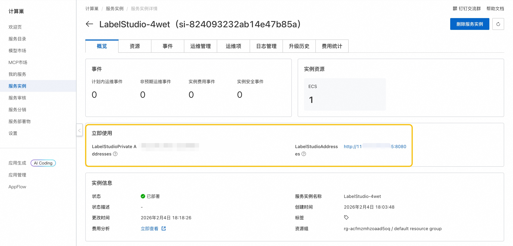

## 🌟 服务简介

> 💥 **无需复杂配置，30 秒启动专业级 AI 数据标注平台！**  
> **Label Studio 社区版**——全球开发者首选的开源数据标注工具，支持图像、文本、音频、视频、时间序列等多模态数据标注。内置智能预标注（AI-assisted labeling）、协作标注、项目管理与数据导出功能，助你高效构建高质量训练数据集，加速 AI 模型迭代！

Label Studio 社区版是一个免费、开源的数据标注平台，专为 AI/ML 团队打造。通过直观的 Web 界面，团队可快速创建标注项目、分配任务、审核结果，并直接导出 COCO、YOLO、Pascal VOC、JSON 等标准格式数据，无缝对接主流训练框架（如 PyTorch、TensorFlow）。

## 🚀 部署流程

> ⚡ **5 分钟极速上线，开箱即用！**  
> 借助阿里云计算巢，一键部署 Label Studio 社区版，省去 Python 环境、数据库、依赖安装等繁琐步骤，立即开启高效数据标注！

### 1. 一键创建实例  
访问 [计算巢 Label Studio 社区版部署页](https://computenest.console.aliyun.com/service/instance/create/cn-hangzhou?type=user&ServiceId=service-75e6894837a944c88195)，填写基础参数（如实例名称、部署地域）：  
  

### 2. 确认资源配置  
系统将自动生成**费用预估明细**。建议选择 ≥2核4GB 配置以保障流畅体验，确认后点击 **下一步：确认订单**。

### 3. 启动部署  
在订单确认页核对信息无误，点击 **立即创建**。部署过程约需 2–4 分钟。

### 4. 获取访问地址  
部署完成后，在控制台查看 **Label Studio 访问地址**：  
  

### 5. 开始使用  
访问服务 URL，首次登录将自动跳转至初始化页面，设置管理员账号后即可创建项目、导入数据、开始标注：  
  

## 📚 使用指南

- **官方文档**：[Label Studio 官方文档](https://labelstud.io/guide/)（含标注模板、API、集成方案）  
- **快速上手**：  
  1. 创建新项目 → 选择数据类型（图像/文本等）  
  2. 导入数据（本地文件、URL、S3 等）  
  3. 设计标注界面（拖拽式配置标签、区域、关系）  
  4. 邀请协作者或启用 AI 预标注  
  5. 导出标注结果（支持 20+ 格式）  
- **核心功能**：  
  - 🖼️ **多模态标注**：图像（边界框、多边形、关键点）、文本（NER、分类）、音频（语音转写）、视频（逐帧标注）  
  - 🤖 **AI 预标注**：集成 Hugging Face、YOLO、CLIP 等模型，自动建议标签  
  - 👥 **团队协作**：任务分配、进度跟踪、审核工作流  
  - 🔒 **数据安全**：支持私有化部署、角色权限控制、数据加密
